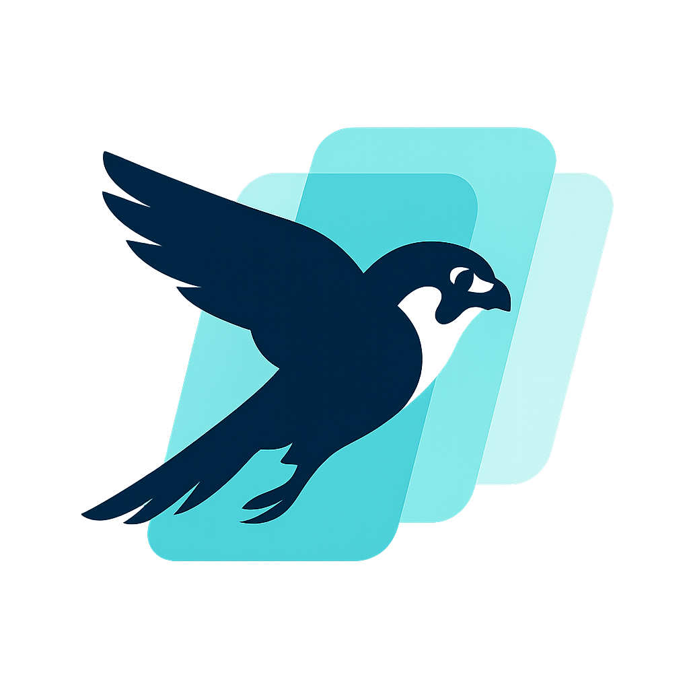

# KestrelTransitions

<p align="center">
  
</p>

A Swift Package Manager library for animating transitions between images in SwiftUI views. Designed for MVVM+C architecture with UIHostingViewControllers nested in UINavigationController transitions.

## Features

- Animate image transitions between SwiftUI views during navigation
- Works with MVVM+C coordinator pattern and UIHostingViewController integration
- Configurable blur effects, shadows, and corner radius morphing
- Automatic frame detection and synchronization between source and destination views
- Professional logging system for debugging transitions

## Installation

### Swift Package Manager

Add KestrelTransitions to your project through Xcode:

1. File → Add Package Dependencies
2. Enter the repository URL: `https://github.com/Kamajabu/KestrelTransitions.git`
3. Select the version and add to your target

Or add it to your `Package.swift`:

```swift
dependencies: [
    .package(url: "https://github.com/Kamajabu/KestrelTransitions.git", from: "1.0.0")
]
```

## Quick Start

### 1. Setup Navigation Controller

First, configure your navigation controller to support KestrelTransitions:

```swift
import KestrelTransitions

class ProductsCoordinator: BaseCoordinator<Void> {
    private let navigationController: UINavigationController
    
    init(navigationController: UINavigationController) {
        self.navigationController = navigationController
        // Enable KestrelTransitions for this navigation controller
        KestrelTransitionRegistry.shared.setupTransition(for: navigationController)
    }
}
```

### 2. Configure Logging (Optional)

Configure logging to see transition debug information:

```swift
import KestrelTransitions

// In your AppDelegate or App struct
func application(_ application: UIApplication, didFinishLaunchingWithOptions launchOptions: [UIApplication.LaunchOptionsKey: Any]?) -> Bool {
    // Configure logging for debug builds
    #if DEBUG
    KestrelLogger.shared.configure(with: .debug)
    #else
    KestrelLogger.shared.configure(with: .production)
    #endif
    
    return true
}
```

### 3. Add Source Transition

In your source view (e.g., list item), add the `kestrelTransitionSource` modifier:

```swift
import SwiftUI
import KestrelTransitions

struct ItemRowView: View {
    let item: Item
    let transitionId: String
    let onTapped: () -> Void
    
    var body: some View {
        HStack {
            Image(item.imageName)
                .resizable()
                .aspectRatio(contentMode: .fill)
                .frame(width: 60, height: 60)
                .cornerRadius(12)
                // Add KestrelTransition source
                .kestrelTransitionSource(
                    id: transitionId,
                    image: UIImage(named: item.imageName) ?? UIImage()
                )
            
            VStack(alignment: .leading) {
                Text(item.name)
                Text(item.category)
            }
        }
        .onTapGesture {
            // Trigger the transition
            triggerKestrelTransition(id: transitionId)
            onTapped()
        }
    }
}
```

### 4. Add Target Transition

In your destination view, add the `kestrelTransitionTarget` modifier:

```swift
import SwiftUI
import KestrelTransitions

struct ItemDetailView: View {
    let item: Item
    let transitionId: String = "itemDetail"
    
    var body: some View {
        ScrollView {
            VStack {
                Image(item.imageName)
                    .resizable()
                    .aspectRatio(contentMode: .fill)
                    .frame(height: 300)
                    .cornerRadius(20)
                    // Add KestrelTransition target
                    .kestrelTransitionTarget(id: transitionId)
                
                Text(item.name)
                    .font(.title)
                
                Text(item.description)
                    .padding()
            }
        }
    }
}
```

## Advanced Configuration

### Custom Transition Configuration

Create custom configurations for different transition styles:

```swift
import KestrelTransitions

// Fast transition with blur effect
let fastBlurConfig = KestrelTransitionConfiguration(
    duration: 0.6,
    springDamping: 0.9,
    springVelocity: 0.1,
    blur: .light
)

// Dramatic transition with pronounced shadow
let dramaticConfig = KestrelTransitionConfiguration(
    duration: 1.5,
    springDamping: 0.7,
    shadow: .pronounced,
    cornerRadius: CornerRadiusConfig(source: 16, destination: 28)
)

// Use custom configuration
Image(item.imageName)
    .kestrelTransitionSource(
        id: "customTransition",
        image: UIImage(named: item.imageName) ?? UIImage(),
        configuration: fastBlurConfig
    )
```

### Configuration Options

#### Transition Configuration

```swift
KestrelTransitionConfiguration(
    duration: 1.0,                    // Animation duration
    springDamping: 0.8,               // Spring damping (0.0 - 1.0)
    springVelocity: 0.0,              // Initial spring velocity
    animationOptions: [.curveEaseInOut], // UIView animation options
    cornerRadius: .default,           // Corner radius configuration
    shadow: .default,                 // Shadow configuration
    blur: .none,                      // Blur configuration
    background: .clear                // Background configuration
)
```

#### Blur Effects

```swift
// Available blur configurations
.none                                 // No blur effect
.light                               // Light blur with thin material
.medium                              // Medium blur with system material
.heavy                               // Heavy blur with thick material

// Custom blur
BlurConfig(
    isEnabled: true,
    style: .systemMaterial,
    intensity: 0.8
)
```

#### Shadow Effects

```swift
// Available shadow configurations
.none                                // No shadow
.default                             // Standard shadow
.subtle                              // Minimal shadow
.pronounced                          // Strong shadow

// Custom shadow
ShadowConfig(
    isEnabled: true,
    color: .black,
    offset: CGSize(width: 0, height: 4),
    opacity: 0.15,
    radius: 8
)
```

#### Corner Radius

```swift
// Available corner radius configurations
.default                             // 12pt source, 20pt destination
.sharp                               // No corner radius
.rounded                             // 16pt source, 24pt destination

// Custom corner radius
CornerRadiusConfig(source: 12, destination: 20)
```

## Preset Configurations

KestrelTransitions includes several preset configurations:

```swift
// Available presets
.default                             // Balanced animation
.fast                                // Quick, snappy transition
.slow                                // Dramatic, slow transition
.blurred                             // With blur effect
.shadowed                            // With pronounced shadow
```

## Usage Examples

### Basic List to Detail Transition

```swift
// In your list view
ForEach(items) { item in
    ItemRowView(
        item: item,
        transitionId: "item_\(item.id)"
    ) {
        // Navigate to detail
        coordinator.showDetail(for: item)
    }
}

// In your detail view
ItemDetailView(item: item)
    .kestrelTransitionTarget(id: "item_\(item.id)")
```

### Custom Tap Handling

```swift
struct CustomView: View {
    var body: some View {
        Image("photo")
            .kestrelTransitionSource(
                id: "customPhoto",
                image: UIImage(named: "photo") ?? UIImage(),
                configuration: .blurred
            )
            .onTapGesture {
                // Custom logic before transition
                performAnalytics()
                
                // Trigger transition
                triggerKestrelTransition(id: "customPhoto")
                
                // Navigate
                navigateToDetail()
            }
    }
}
```

### Photo Gallery Example

```swift
struct PhotoGalleryView: View {
    let photos: [Photo]
    
    var body: some View {
        LazyVGrid(columns: gridColumns) {
            ForEach(photos) { photo in
                AsyncImage(url: photo.thumbnailURL) { image in
                    image
                        .resizable()
                        .aspectRatio(contentMode: .fill)
                        .frame(width: 120, height: 120)
                        .cornerRadius(8)
                        .kestrelTransitionSource(
                            id: "photo_\(photo.id)",
                            image: image.asUIImage() ?? UIImage(),
                            configuration: .fast
                        )
                        .onTapGesture {
                            triggerKestrelTransition(id: "photo_\(photo.id)")
                            showPhotoDetail(photo)
                        }
                } placeholder: {
                    RoundedRectangle(cornerRadius: 8)
                        .fill(Color.gray.opacity(0.3))
                        .frame(width: 120, height: 120)
                }
            }
        }
    }
}

struct PhotoDetailView: View {
    let photo: Photo
    
    var body: some View {
        VStack {
            AsyncImage(url: photo.fullURL) { image in
                image
                    .resizable()
                    .aspectRatio(contentMode: .fit)
                    .kestrelTransitionTarget(id: "photo_\(photo.id)")
            } placeholder: {
                ProgressView()
            }
            
            Text(photo.title)
                .font(.title)
                .padding()
        }
    }
}
```

## Logging Configuration

### Log Levels

- **Debug**: Verbose logging for development
- **Info**: General information about transitions
- **Warning**: Potential issues or fallbacks
- **Error**: Critical errors only

### Configuration Examples

```swift
// Development environment
KestrelLogger.shared.configure(with: .debug)

// Production environment
KestrelLogger.shared.configure(with: .production)

// Custom configuration
KestrelLogger.shared.configure(with: KestrelLoggingConfig(
    isEnabled: true,
    level: .info,
    subsystem: "com.yourapp.transitions",
    category: "CustomTransitions"
))

// Disable logging completely
KestrelLogger.shared.configure(with: KestrelLoggingConfig(isEnabled: false))
```

## Troubleshooting

### Common Issues

1. **Transition not triggering**
   - Ensure `KestrelTransitionRegistry.shared.setupTransition(for:)` is called
   - Verify transition IDs match between source and target
   - Check that `triggerKestrelTransition(id:)` is called

2. **Image not animating**
   - Confirm the UIImage is properly loaded and not nil
   - Verify the source frame is captured correctly
   - Check that the target view is rendered before transition

3. **Frame detection issues**
   - Ensure target view has non-zero size
   - Verify view hierarchy allows frame calculation
   - Check that geometry is available when preference changes

### Debug Logging

Enable debug logging to see detailed information:

```swift
KestrelLogger.shared.configure(with: .debug)
```

This will show:
- Frame capture events
- Transition trigger events
- Animation phase transitions
- Error conditions

## Architecture

- `KestrelTransitionAnimator`: Core UIKit transition animator with configurable animations
- `KestrelTransitionModifier`: SwiftUI view modifier for source views with configuration support
- `KestrelTransitionTargetModifier`: SwiftUI view modifier for destination views
- `KestrelTransitionRegistry`: Central registry for managing transitions and frames
- `KestrelTransitionConfiguration`: Comprehensive configuration system for all animation aspects
- `KestrelLogger`: Professional logging system with configurable levels

## Requirements

- iOS 15.0+
- Swift 5.9+
- Xcode 14.0+

## License

KestrelTransitions is available under the MIT license. See the LICENSE file for more info.

## Contributing

Contributions are welcome! Please feel free to submit a Pull Request.